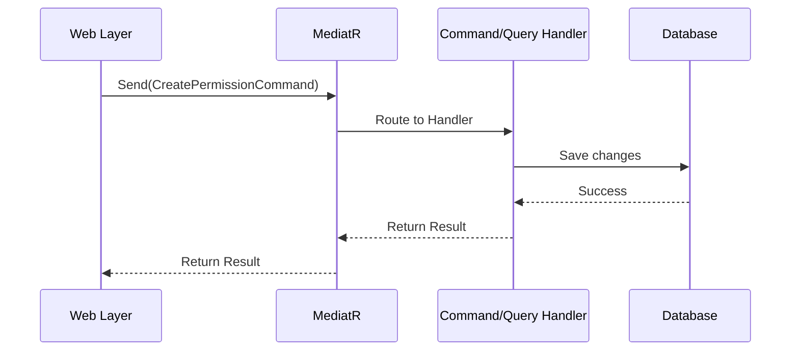
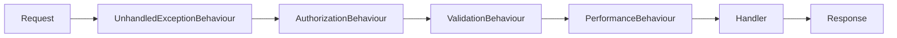

## What is CQRS?

**CQRS** (Command Query Responsibility Segregation) is a pattern that separates read operations (Queries) from write operations (Commands).

<CardGroup cols={2}>
  <Card title="Commands" icon="pen" color="#ea5a0c">
    Operations that **change state** and return minimal data (success/failure, ID)
  </Card>
  <Card title="Queries" icon="search" color="#0285c7">
    Operations that **read data** without side effects
  </Card>
</CardGroup>

## Why CQRS?

<AccordionGroup>
  <Accordion title="Separation of Concerns">
    - Commands handle business logic and validation
    - Queries focus on efficient data retrieval
    - Different optimization strategies for reads vs writes
  </Accordion>
  
  <Accordion title="Scalability">
    - Scale read and write operations independently
    - Use read replicas for queries
    - Optimize write database for transactions
  </Accordion>
  
  <Accordion title="Maintainability">
    - Clear intent: "What does this code do?"
    - Easy to find and modify operations
    - Reduced coupling between operations
  </Accordion>
  
  <Accordion title="Performance">
    - Queries can be optimized differently than commands
    - Use projections and denormalization for reads
    - Commands focus on consistency and validation
  </Accordion>
</AccordionGroup>

## CQRS with MediatR

SAPFIAI implements CQRS using **MediatR**, a mediator pattern library for .NET.

### How MediatR Works



<Info>
  MediatR acts as a **mediator** between your API and your business logic, decoupling the sender from the receiver.
</Info>

## Commands (Write Operations)

Commands represent actions that change the system state.

### Command Structure

Every command in SAPFIAI follows this structure:

```
Commands/CreatePermission/
├── CreatePermissionCommand.cs          # The request
├── CreatePermissionCommandHandler.cs   # Business logic
└── CreatePermissionCommandValidator.cs # Validation rules
```

### Command Example: Create Permission

<Steps>
  <Step title="Define the Command">
    The command is a record that implements `IRequest<TResponse>`:
    
    ```csharp
    // src/Application/Permissions/Commands/CreatePermission/CreatePermissionCommand.cs
    using SAPFIAI.Application.Common.Models;

    namespace SAPFIAI.Application.Permissions.Commands.CreatePermission;

    public record CreatePermissionCommand : IRequest<Result<int>>
    {
        public required string Name { get; init; }
        public string? Description { get; init; }
        public required string Module { get; init; }
    }
    ```
    
    **Location**: `src/Application/Permissions/Commands/CreatePermission/CreatePermissionCommand.cs:5-10`
    
    <Note>
      - Uses `record` for immutability
      - Returns `Result<int>` (success with ID or failure with error)
      - Properties are `init`-only (set once during creation)
    </Note>
  </Step>
  
  <Step title="Implement the Handler">
    The handler contains the business logic:
    
    ```csharp
    // src/Application/Permissions/Commands/CreatePermission/CreatePermissionCommandHandler.cs
    using SAPFIAI.Application.Common.Interfaces;
    using SAPFIAI.Application.Common.Models;
    using SAPFIAI.Domain.Entities;
    using Microsoft.Extensions.Logging;

    namespace SAPFIAI.Application.Permissions.Commands.CreatePermission;

    public class CreatePermissionCommandHandler 
        : IRequestHandler<CreatePermissionCommand, Result<int>>
    {
        private readonly IApplicationDbContext _context;
        private readonly ILogger<CreatePermissionCommandHandler> _logger;

        public CreatePermissionCommandHandler(
            IApplicationDbContext context, 
            ILogger<CreatePermissionCommandHandler> logger)
        {
            _context = context;
            _logger = logger;
        }

        public async Task<Result<int>> Handle(
            CreatePermissionCommand request, 
            CancellationToken cancellationToken)
        {
            _logger.LogInformation("Creating permission: {PermissionName}", request.Name);
            
            // Check if permission already exists
            var exists = await _context.Permissions
                .AnyAsync(p => p.Name == request.Name, cancellationToken);

            if (exists)
            {
                _logger.LogWarning("Permission already exists: {PermissionName}", request.Name);
                return Result.Failure<int>(
                    new Error("PermissionExists", "El permiso ya existe"));
            }

            // Create the entity
            var permission = new Permission
            {
                Name = request.Name,
                Description = request.Description,
                Module = request.Module,
                IsActive = true,
                CreatedAt = DateTime.UtcNow
            };

            // Save to database
            _context.Permissions.Add(permission);
            await _context.SaveChangesAsync(cancellationToken);

            _logger.LogInformation("Permission created successfully: {PermissionId}", permission.Id);
            return Result.Success(permission.Id);
        }
    }
    ```
    
    **Location**: `src/Application/Permissions/Commands/CreatePermission/CreatePermissionCommandHandler.cs:8-47`
  </Step>
  
  <Step title="Add Validation">
    FluentValidation rules ensure data integrity:
    
    ```csharp
    // src/Application/Permissions/Commands/CreatePermission/CreatePermissionCommandValidator.cs
    namespace SAPFIAI.Application.Permissions.Commands.CreatePermission;

    public class CreatePermissionCommandValidator 
        : AbstractValidator<CreatePermissionCommand>
    {
        public CreatePermissionCommandValidator()
        {
            RuleFor(x => x.Name)
                .NotEmpty().WithMessage("El nombre del permiso es requerido")
                .MaximumLength(100).WithMessage("El nombre no puede exceder 100 caracteres")
                .Matches("^[a-z0-9._-]+$")
                .WithMessage("Use formato: modulo.accion (ej: users.create)");

            RuleFor(x => x.Module)
                .NotEmpty().WithMessage("El módulo es requerido")
                .MaximumLength(50).WithMessage("El módulo no puede exceder 50 caracteres");

            RuleFor(x => x.Description)
                .MaximumLength(500).WithMessage("La descripción no puede exceder 500 caracteres")
                .When(x => !string.IsNullOrEmpty(x.Description));
        }
    }
    ```
    
    **Location**: `src/Application/Permissions/Commands/CreatePermission/CreatePermissionCommandValidator.cs:3-20`
    
    <Tip>
      Validation runs automatically through the `ValidationBehaviour` pipeline before the handler executes.
    </Tip>
  </Step>
  
  <Step title="Use in API">
    The Web layer sends the command via MediatR:
    
    ```csharp
    // src/Web/Endpoints/Permissions.cs
    private static async Task<IResult> CreatePermission(
        IMediator mediator, 
        [FromBody] CreatePermissionCommand command)
    {
        var result = await mediator.Send(command);
        return result.ToCreatedResult(id => $"/api/permissions/{id}");
    }
    ```
    
    **Location**: `src/Web/Endpoints/Permissions.cs:83-86`
  </Step>
</Steps>

### Command Characteristics

<CardGroup cols={2}>
  <Card title="State Changing" icon="database">
    Commands modify the database or system state
  </Card>
  <Card title="Return Minimal Data" icon="check">
    Usually return success/failure and ID of created entity
  </Card>
  <Card title="Side Effects" icon="bolt">
    Can trigger events, send emails, or update caches
  </Card>
  <Card title="Validated" icon="shield">
    Always run through validation pipeline
  </Card>
</CardGroup>

### More Command Examples

<Tabs>
  <Tab title="Update Command">
    ```csharp
    // src/Application/Permissions/Commands/UpdatePermission/UpdatePermissionCommand.cs
    public record UpdatePermissionCommand : IRequest<Result>
    {
        public int PermissionId { get; init; }
        public required string Name { get; init; }
        public string? Description { get; init; }
        public required string Module { get; init; }
        public bool IsActive { get; init; }
    }
    ```
    
    <Info>
      Update commands include the entity ID and return `Result` (success/failure without data).
    </Info>
  </Tab>
  
  <Tab title="Delete Command">
    ```csharp
    // src/Application/Permissions/Commands/DeletePermission/DeletePermissionCommand.cs
    public record DeletePermissionCommand : IRequest<Result>
    {
        public int PermissionId { get; init; }
    }
    ```
    
    <Info>
      Delete commands only need the ID and return simple success/failure.
    </Info>
  </Tab>
  
  <Tab title="Assign Command">
    ```csharp
    // src/Application/Permissions/Commands/AssignPermissionToRole/AssignPermissionToRoleCommand.cs
    public record AssignPermissionToRoleCommand : IRequest<Result>
    {
        public required string RoleId { get; init; }
        public int PermissionId { get; init; }
    }
    ```
    
    <Info>
      Commands for relationships include both entity IDs.
    </Info>
  </Tab>
</Tabs>

## Queries (Read Operations)

Queries retrieve data without modifying state.

### Query Structure

```
Queries/GetPermissions/
├── GetPermissionsQuery.cs       # The request
└── GetPermissionsQueryHandler.cs # Data retrieval logic
```

<Note>
  Queries typically **don't need validators** since they don't modify data. Simple validation (like required IDs) can be done in the handler.
</Note>

### Query Example: Get Permissions

<Steps>
  <Step title="Define the Query">
    ```csharp
    // src/Application/Permissions/Queries/GetPermissions/GetPermissionsQuery.cs
    using SAPFIAI.Application.Common.Models;

    namespace SAPFIAI.Application.Permissions.Queries.GetPermissions;

    public record GetPermissionsQuery : IRequest<List<PermissionDto>>
    {
        public bool ActiveOnly { get; init; } = false;
    }
    ```
    
    **Location**: `src/Application/Permissions/Queries/GetPermissions/GetPermissionsQuery.cs:5-8`
    
    <Info>
      Queries return DTOs (Data Transfer Objects) like `PermissionDto`, not domain entities.
    </Info>
  </Step>
  
  <Step title="Implement the Handler">
    ```csharp
    // src/Application/Permissions/Queries/GetPermissions/GetPermissionsQueryHandler.cs
    using SAPFIAI.Application.Common.Interfaces;
    using SAPFIAI.Application.Common.Models;

    namespace SAPFIAI.Application.Permissions.Queries.GetPermissions;

    public class GetPermissionsQueryHandler 
        : IRequestHandler<GetPermissionsQuery, List<PermissionDto>>
    {
        private readonly IApplicationDbContext _context;

        public GetPermissionsQueryHandler(IApplicationDbContext context)
        {
            _context = context;
        }

        public async Task<List<PermissionDto>> Handle(
            GetPermissionsQuery request, 
            CancellationToken cancellationToken)
        {
            var query = _context.Permissions.AsQueryable();

            // Apply filters
            if (request.ActiveOnly)
            {
                query = query.Where(p => p.IsActive);
            }

            // Project to DTO
            return await query
                .Select(p => new PermissionDto
                {
                    Id = p.Id,
                    Name = p.Name,
                    Description = p.Description,
                    Module = p.Module,
                    IsActive = p.IsActive,
                    CreatedAt = p.CreatedAt
                })
                .ToListAsync(cancellationToken);
        }
    }
    ```
    
    **Location**: `src/Application/Permissions/Queries/GetPermissions/GetPermissionsQueryHandler.cs:6-36`
  </Step>
  
  <Step title="Use in API">
    ```csharp
    // src/Web/Endpoints/Permissions.cs
    private static async Task<IResult> GetPermissions(
        IMediator mediator, 
        [FromQuery] bool activeOnly = false)
    {
        var permissions = await mediator.Send(
            new GetPermissionsQuery { ActiveOnly = activeOnly });
        return Results.Ok(permissions);
    }
    ```
    
    **Location**: `src/Web/Endpoints/Permissions.cs:65-68`
  </Step>
</Steps>

### Query Characteristics

<CardGroup cols={2}>
  <Card title="Read-Only" icon="book-open">
    Never modify the database or system state
  </Card>
  <Card title="Return Data" icon="table">
    Return DTOs optimized for the client's needs
  </Card>
  <Card title="Optimized" icon="gauge">
    Use projections and includes for performance
  </Card>
  <Card title="Cacheable" icon="clock">
    Safe to cache since they don't change state
  </Card>
</CardGroup>

### More Query Examples

<Tabs>
  <Tab title="Get By ID">
    ```csharp
    // src/Application/Permissions/Queries/GetPermissionById/GetPermissionByIdQuery.cs
    public record GetPermissionByIdQuery : IRequest<PermissionDto?>
    {
        public int PermissionId { get; init; }
    }
    ```
    
    <Info>
      Returns `PermissionDto?` (nullable) since the permission might not exist.
    </Info>
  </Tab>
  
  <Tab title="Get with Relationship">
    ```csharp
    // src/Application/Permissions/Queries/GetRolePermissions/GetRolePermissionsQuery.cs
    public record GetRolePermissionsQuery : IRequest<List<PermissionDto>>
    {
        public required string RoleId { get; init; }
    }
    ```
    
    <Info>
      Queries can filter by relationships (e.g., permissions for a specific role).
    </Info>
  </Tab>
  
  <Tab title="Paginated Query">
    ```csharp
    // Example: Paginated query
    public record GetPermissionsWithPaginationQuery 
        : IRequest<PaginatedList<PermissionDto>>
    {
        public int PageNumber { get; init; } = 1;
        public int PageSize { get; init; } = 10;
        public string? SearchTerm { get; init; }
    }
    ```
    
    <Info>
      For large datasets, use pagination with `PaginatedList<T>`.
    </Info>
  </Tab>
</Tabs>

## MediatR Pipeline Behaviors

Behaviors are like middleware for MediatR requests, running before/after handlers.

### Registered Behaviors

```csharp
// src/Application/DependencyInjection.cs
services.AddMediatR(cfg => {
    cfg.RegisterServicesFromAssembly(Assembly.GetExecutingAssembly());
    cfg.AddBehavior(typeof(IPipelineBehavior<,>), typeof(UnhandledExceptionBehaviour<,>));
    cfg.AddBehavior(typeof(IPipelineBehavior<,>), typeof(AuthorizationBehaviour<,>));
    cfg.AddBehavior(typeof(IPipelineBehavior<,>), typeof(ValidationBehaviour<,>));
    cfg.AddBehavior(typeof(IPipelineBehavior<,>), typeof(PerformanceBehaviour<,>));
});
```

**Location**: `src/Application/DependencyInjection.cs:14-20`

### Behavior Execution Order



<AccordionGroup>
  <Accordion title="UnhandledExceptionBehaviour">
    Catches and logs any unhandled exceptions:
    
    ```csharp
    // src/Application/Common/Behaviours/UnhandledExceptionBehaviour.cs
    public async Task<TResponse> Handle(
        TRequest request, 
        RequestHandlerDelegate<TResponse> next, 
        CancellationToken cancellationToken)
    {
        try
        {
            return await next();
        }
        catch (Exception ex)
        {
            _logger.LogError(ex, "Unhandled exception for {Name}", 
                typeof(TRequest).Name);
            throw;
        }
    }
    ```
    
    **Location**: `src/Application/Common/Behaviours/UnhandledExceptionBehaviour.cs`
  </Accordion>
  
  <Accordion title="AuthorizationBehaviour">
    Checks if the user has required permissions:
    
    ```csharp
    // src/Application/Common/Behaviours/AuthorizationBehaviour.cs
    public async Task<TResponse> Handle(...)
    {
        var authorizeAttributes = request.GetType()
            .GetCustomAttributes<AuthorizeAttribute>();

        if (authorizeAttributes.Any())
        {
            // Check if user is authenticated
            if (_user.Id == null)
            {
                throw new UnauthorizedAccessException();
            }

            // Check permissions
            var authorizeAttributesWithPermissions = authorizeAttributes
                .Where(a => !string.IsNullOrWhiteSpace(a.Permissions));

            if (authorizeAttributesWithPermissions.Any())
            {
                // Validate user has required permissions
                foreach (var permission in authorizeAttributesWithPermissions
                    .SelectMany(a => a.Permissions.Split(',')))
                {
                    var hasPermission = await _identityService
                        .AuthorizeAsync(_user.Id, permission.Trim());
                    
                    if (!hasPermission)
                    {
                        throw new ForbiddenAccessException();
                    }
                }
            }
        }

        return await next();
    }
    ```
    
    **Location**: `src/Application/Common/Behaviours/AuthorizationBehaviour.cs`
  </Accordion>
  
  <Accordion title="ValidationBehaviour">
    Runs FluentValidation rules automatically:
    
    ```csharp
    // src/Application/Common/Behaviours/ValidationBehaviour.cs
    public async Task<TResponse> Handle(
        TRequest request, 
        RequestHandlerDelegate<TResponse> next, 
        CancellationToken cancellationToken)
    {
        if (_validators.Any())
        {
            var context = new ValidationContext<TRequest>(request);

            var validationResults = await Task.WhenAll(
                _validators.Select(v => 
                    v.ValidateAsync(context, cancellationToken)));

            var failures = validationResults
                .Where(r => r.Errors.Any())
                .SelectMany(r => r.Errors)
                .ToList();

            if (failures.Any())
                throw new ValidationException(failures);
        }
        return await next();
    }
    ```
    
    **Location**: `src/Application/Common/Behaviours/ValidationBehaviour.cs:15-34`
  </Accordion>
  
  <Accordion title="PerformanceBehaviour">
    Logs slow requests for monitoring:
    
    ```csharp
    // src/Application/Common/Behaviours/PerformanceBehaviour.cs
    public async Task<TResponse> Handle(...)
    {
        var stopwatch = Stopwatch.StartNew();
        var response = await next();
        stopwatch.Stop();

        var elapsedMilliseconds = stopwatch.ElapsedMilliseconds;

        if (elapsedMilliseconds > 500) // Log if > 500ms
        {
            _logger.LogWarning(
                "Long Running Request: {Name} ({ElapsedMilliseconds} ms)",
                typeof(TRequest).Name, 
                elapsedMilliseconds);
        }

        return response;
    }
    ```
    
    **Location**: `src/Application/Common/Behaviours/PerformanceBehaviour.cs`
  </Accordion>
</AccordionGroup>

<Tip>
  Behaviors run for **every** MediatR request, providing consistent cross-cutting concerns.
</Tip>

## Best Practices

### Command Best Practices

<Check>
  **Do:**
  - Use `record` types for immutability
  - Return `Result&lt;T&gt;` for operations that can fail
  - Always create validators for commands
  - Log important actions in handlers
  - Use descriptive command names (`CreatePermissionCommand`, not `PermissionCommand`)
</Check>

<Warning>
  **Don't:**
  - Return full entities from commands (use IDs instead)
  - Put UI logic in command handlers
  - Make commands depend on each other
  - Skip validation for "simple" commands
</Warning>

### Query Best Practices

<Check>
  **Do:**
  - Return DTOs, not domain entities
  - Use `AsNoTracking()` for read-only queries
  - Project early with `Select()` to reduce data transfer
  - Use pagination for large datasets
  - Cache query results when appropriate
</Check>

<Warning>
  **Don't:**
  - Modify state in query handlers
  - Return `IQueryable` (execute queries in handler)
  - Include unnecessary data in DTOs
  - Forget to handle null cases
</Warning>

### Naming Conventions

| Type | Convention | Example |
|------|------------|----------|
| **Command** | `{Verb}{Entity}Command` | `CreatePermissionCommand` |
| **Command Handler** | `{CommandName}Handler` | `CreatePermissionCommandHandler` |
| **Validator** | `{CommandName}Validator` | `CreatePermissionCommandValidator` |
| **Query** | `Get{Entity/Entities}Query` | `GetPermissionsQuery` |
| **Query Handler** | `{QueryName}Handler` | `GetPermissionsQueryHandler` |
| **DTO** | `{Entity}Dto` | `PermissionDto` |

## Testing CQRS

### Unit Test Example

```csharp
// tests/Application.UnitTests/Permissions/Commands/CreatePermissionCommandTests.cs
[Test]
public async Task Handle_ValidCommand_CreatesPermission()
{
    // Arrange
    var context = ApplicationDbContextFactory.Create();
    var logger = Mock.Of<ILogger<CreatePermissionCommandHandler>>();
    var handler = new CreatePermissionCommandHandler(context, logger);
    
    var command = new CreatePermissionCommand
    {
        Name = "users.create",
        Description = "Create users",
        Module = "users"
    };

    // Act
    var result = await handler.Handle(command, CancellationToken.None);

    // Assert
    result.IsSuccess.Should().BeTrue();
    result.Value.Should().BeGreaterThan(0);
    
    var permission = await context.Permissions
        .FindAsync(result.Value);
    permission.Should().NotBeNull();
    permission!.Name.Should().Be("users.create");
}
```

### Functional Test Example

```csharp
// tests/Application.FunctionalTests/Permissions/CreatePermissionTests.cs
[Test]
public async Task CreatePermission_ReturnsCreated()
{
    // Arrange
    await RunAsAdministratorAsync();
    
    var command = new CreatePermissionCommand
    {
        Name = "users.create",
        Description = "Create users",
        Module = "users"
    };

    // Act
    var response = await _client.PostAsJsonAsync("/api/permissions", command);

    // Assert
    response.StatusCode.Should().Be(HttpStatusCode.Created);
    response.Headers.Location.Should().NotBeNull();
}
```

## Next Steps

<CardGroup cols={2}>
  <Card title="Creating Use Cases" icon="plus" href="/guides/creating-use-cases">
    Learn to create your own Commands and Queries
  </Card>
  <Card title="Validation" icon="shield" href="/concepts/validation">
    Deep dive into FluentValidation
  </Card>
  <Card title="Testing" icon="flask" href="/development/testing">
    Testing Commands and Queries
  </Card>
  <Card title="Result Pattern" icon="check-circle" href="/concepts/error-handling">
    Error handling with Result&lt;T&gt;
  </Card>
</CardGroup>
