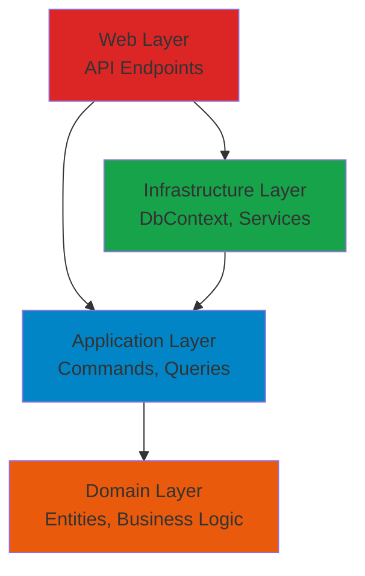

## Introduction

SAPFIAI is built using **Clean Architecture** principles, creating a maintainable, testable, and scalable API solution. The architecture separates concerns into distinct layers, with dependencies flowing inward toward the domain core.

## Architecture Layers

The solution is organized into four main layers:

<CardGroup cols={2}>
  <Card title="Domain Layer" icon="cube" color="#ea5a0c">
    Core business logic and entities. No external dependencies.
  </Card>
  <Card title="Application Layer" icon="gear" color="#0285c7">
    Use cases, CQRS commands/queries, and business orchestration.
  </Card>
  <Card title="Infrastructure Layer" icon="database" color="#16a34a">
    Data persistence, external services, and third-party integrations.
  </Card>
  <Card title="Web Layer" icon="globe" color="#dc2626">
    API endpoints, middleware, and HTTP concerns.
  </Card>
</CardGroup>

## Dependency Flow

The architecture enforces a strict dependency rule:

```
Web Layer → Infrastructure Layer → Application Layer → Domain Layer
```

<Note>
  Dependencies point **inward**. The Domain layer has zero external dependencies, while outer layers depend on inner layers through abstractions (interfaces).
</Note>

### Visual Representation



## Layer Interactions

### Request Flow Example

Let's follow a typical API request through the layers:

<Steps>
  <Step title="API Request">
    Client sends a POST request to `/api/permissions` to create a new permission.
  </Step>
  
  <Step title="Web Layer">
    The endpoint receives the request and sends a `CreatePermissionCommand` via MediatR.
    
    ```csharp
    // src/Web/Endpoints/Permissions.cs:83-86
    private static async Task<IResult> CreatePermission(
        IMediator mediator, 
        [FromBody] CreatePermissionCommand command)
    {
        var result = await mediator.Send(command);
        return result.ToCreatedResult(id => $"/api/permissions/{id}");
    }
    ```
  </Step>
  
  <Step title="Application Layer">
    MediatR routes the command to its handler, which contains the use case logic.
    
    ```csharp
    // src/Application/Permissions/Commands/CreatePermission
    public class CreatePermissionCommandHandler 
        : IRequestHandler<CreatePermissionCommand, Result<int>>
    {
        public async Task<Result<int>> Handle(...)
        {
            // Business logic here
            var permission = new Permission { ... };
            _context.Permissions.Add(permission);
            await _context.SaveChangesAsync(cancellationToken);
            return Result.Success(permission.Id);
        }
    }
    ```
  </Step>
  
  <Step title="Infrastructure Layer">
    The `ApplicationDbContext` persists the entity to the database.
    
    ```csharp
    // src/Infrastructure/Data/ApplicationDbContext.cs
    public class ApplicationDbContext : IdentityDbContext<ApplicationUser>
    {
        public DbSet<Permission> Permissions => Set<Permission>();
    }
    ```
  </Step>
  
  <Step title="Domain Layer">
    The `Permission` entity defines the business rules and data structure.
    
    ```csharp
    // src/Domain/Entities/Permission.cs
    public class Permission : BaseEntity
    {
        public string Name { get; set; }
        public string Module { get; set; }
        public bool IsActive { get; set; }
    }
    ```
  </Step>
</Steps>

## Key Benefits

<AccordionGroup>
  <Accordion title="Testability">
    Each layer can be tested independently:
    - **Domain**: Pure unit tests with no mocking
    - **Application**: Test use cases with mocked dependencies
    - **Infrastructure**: Integration tests with real databases
    - **Web**: Functional tests for end-to-end scenarios
  </Accordion>

  <Accordion title="Maintainability">
    - Clear separation of concerns
    - Each layer has a single responsibility
    - Easy to locate and modify code
    - Changes in one layer rarely affect others
  </Accordion>

  <Accordion title="Flexibility">
    - Swap implementations without changing business logic
    - Easy to switch databases (SQL Server → PostgreSQL)
    - Change UI frameworks without touching the core
    - Add new features without modifying existing code
  </Accordion>

  <Accordion title="Scalability">
    - Independent deployment of layers
    - Microservices-ready architecture
    - Horizontal scaling of specific components
    - Performance optimization per layer
  </Accordion>
</AccordionGroup>

## Technology Stack

The architecture leverages modern .NET technologies:

| Layer | Technologies |
|-------|-------------|
| **Domain** | .NET 8, C# Records |
| **Application** | MediatR, FluentValidation, AutoMapper |
| **Infrastructure** | Entity Framework Core 8, SQL Server, ASP.NET Identity |
| **Web** | ASP.NET Core 8, Minimal APIs, Swagger/OpenAPI |

## Cross-Cutting Concerns

Several patterns span multiple layers:

### MediatR Pipeline Behaviors

The application uses pipeline behaviors for cross-cutting concerns:

```csharp
// src/Application/DependencyInjection.cs:16-19
services.AddMediatR(cfg => {
    cfg.AddBehavior(typeof(IPipelineBehavior<,>), typeof(UnhandledExceptionBehaviour<,>));
    cfg.AddBehavior(typeof(IPipelineBehavior<,>), typeof(AuthorizationBehaviour<,>));
    cfg.AddBehavior(typeof(IPipelineBehavior<,>), typeof(ValidationBehaviour<,>));
    cfg.AddBehavior(typeof(IPipelineBehavior<,>), typeof(PerformanceBehaviour<,>));
});
```

These behaviors automatically handle:
- **Exception handling**: Catches and logs unhandled exceptions
- **Authorization**: Validates user permissions before execution
- **Validation**: Runs FluentValidation rules automatically
- **Performance**: Logs slow requests for monitoring

<Tip>
  Pipeline behaviors run for **every** MediatR request, providing consistent behavior across all use cases.
</Tip>

## Next Steps

<CardGroup cols={2}>
  <Card title="Clean Architecture" icon="book" href="/architecture/clean-architecture">
    Deep dive into Clean Architecture principles
  </Card>
  <Card title="Project Structure" icon="folder-tree" href="/architecture/project-structure">
    Detailed breakdown of folders and files
  </Card>
  <Card title="CQRS Pattern" icon="code-branch" href="/architecture/cqrs-pattern">
    Learn about Commands and Queries
  </Card>
  <Card title="Getting Started" icon="rocket" href="/getting-started/installation">
    Start building with SAPFIAI
  </Card>
</CardGroup>
