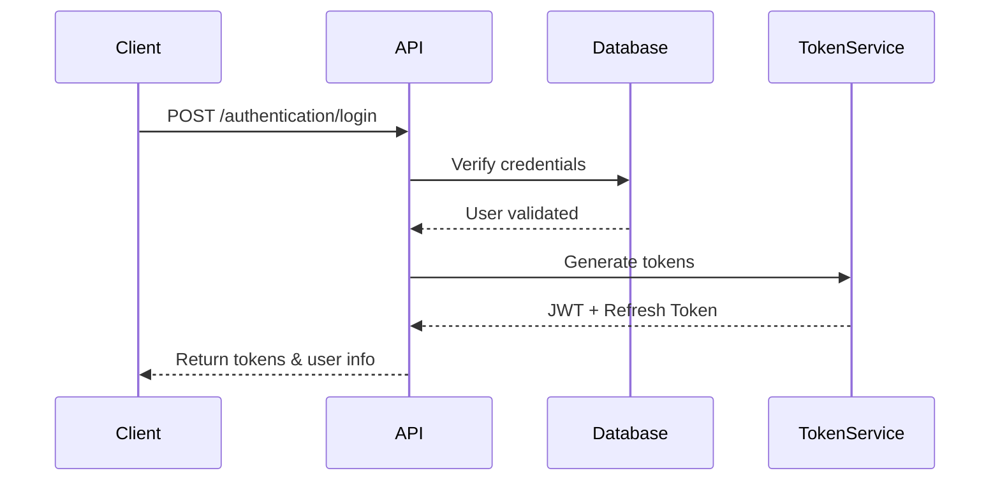

## Overview

SAPFIAI implements a comprehensive authentication system using JSON Web Tokens (JWT) with support for:

- **JWT Access Tokens** - Short-lived tokens for API authentication
- **Refresh Tokens** - Long-lived tokens for obtaining new access tokens
- **Two-Factor Authentication (2FA)** - Optional second layer of security
- **Password Reset Flow** - Secure password recovery mechanism
- **Audit Logging** - Track all authentication events

<CardGroup cols={2}>
  <Card title="JWT Authentication" icon="key" href="/security/jwt-authentication">
    Deep dive into JWT token generation and validation
  </Card>
  <Card title="Two-Factor Auth" icon="shield-halved" href="/security/two-factor-auth">
    Learn about 2FA implementation and usage
  </Card>
</CardGroup>

## Authentication Flow

### Basic Login Flow



### Two-Factor Authentication Flow

When 2FA is enabled, the login process includes an additional verification step:

<Steps>
  <Step title="Initial login">
    User provides email and password
    ```csharp
    var loginCommand = new LoginCommand
    {
        Email = "user@example.com",
        Password = "SecurePassword123!"
    };
    var response = await mediator.Send(loginCommand);
    ```
  </Step>

  <Step title="Check 2FA requirement">
    API returns a token with `requires2FA: true` flag
    ```json
    {
      "success": true,
      "token": "eyJhbGci...",
      "requires2FA": true,
      "userId": "user-id-123"
    }
    ```
  </Step>

  <Step title="Verify 2FA code">
    User receives 6-digit code via email and submits it
    ```csharp
    var verifyCommand = new ValidateTwoFactorCommand
    {
        UserId = "user-id-123",
        Code = "123456"
    };
    var finalResponse = await mediator.Send(verifyCommand);
    ```
  </Step>

  <Step title="Receive full access">
    API returns final token without 2FA restrictions
    ```json
    {
      "success": true,
      "token": "eyJhbGci...",
      "refreshToken": "base64-encoded-token",
      "requires2FA": false
    }
    ```
  </Step>
</Steps>

## JWT Token Structure

JWT tokens generated by SAPFIAI include the following claims:

### Standard Claims

<ParamField path="sub" type="string" required>
  User ID (subject claim)
</ParamField>

<ParamField path="email" type="string" required>
  User's email address
</ParamField>

<ParamField path="jti" type="string" required>
  Unique token identifier (JWT ID)
</ParamField>

### Custom Claims

<ParamField path="2fa_pending" type="boolean" required>
  Indicates if two-factor authentication is pending
</ParamField>

<ParamField path="role" type="string[]">
  Array of user roles (e.g., "Administrator", "User")
</ParamField>

<ParamField path="permission" type="string[]">
  Array of user permissions (e.g., "users.create", "reports.view")
</ParamField>

### Token Generation Implementation

From `src/Infrastructure/Services/JwtTokenGenerator.cs:21`:

```csharp JwtTokenGenerator.cs
public string GenerateToken(
    string userId, 
    string email, 
    IEnumerable<string>? roles = null, 
    IEnumerable<string>? permissions = null, 
    bool requiresTwoFactorVerification = false)
{
    var jwtKey = _configuration["Jwt:Key"];
    var jwtIssuer = _configuration["Jwt:Issuer"] ?? "SAPFIAI";
    var jwtAudience = _configuration["Jwt:Audience"] ?? "SAPFIAI-Users";
    var jwtExpireMinutes = int.Parse(_configuration["Jwt:ExpireMinutes"] ?? "60");

    var securityKey = new SymmetricSecurityKey(Encoding.UTF8.GetBytes(jwtKey));
    var credentials = new SigningCredentials(securityKey, SecurityAlgorithms.HmacSha256);

    var claims = new List<Claim>
    {
        new(JwtRegisteredClaimNames.Sub, userId),
        new(JwtRegisteredClaimNames.Email, email),
        new(JwtRegisteredClaimNames.Jti, Guid.NewGuid().ToString()),
        new(ClaimTypes.NameIdentifier, userId),
        new("2fa_pending", requiresTwoFactorVerification.ToString().ToLower())
    };

    // Add roles and permissions
    if (roles != null)
    {
        foreach (var role in roles)
            claims.Add(new Claim(ClaimTypes.Role, role));
    }

    if (permissions != null)
    {
        foreach (var permission in permissions)
            claims.Add(new Claim("permission", permission));
    }

    var token = new JwtSecurityToken(
        issuer: jwtIssuer,
        audience: jwtAudience,
        claims: claims,
        expires: DateTime.UtcNow.AddMinutes(jwtExpireMinutes),
        signingCredentials: credentials
    );

    return new JwtSecurityTokenHandler().WriteToken(token);
}
```

## Refresh Token Mechanism

Refresh tokens allow clients to obtain new access tokens without re-authenticating:

### RefreshToken Entity

From `src/Domain/Entities/RefreshToken.cs`:

<ResponseField name="token" type="string">
  Base64-encoded cryptographically secure random token
</ResponseField>

<ResponseField name="userId" type="string">
  ID of the user who owns this token
</ResponseField>

<ResponseField name="expiresAt" type="DateTime">
  Token expiration timestamp
</ResponseField>

<ResponseField name="createdAt" type="DateTime">
  Token creation timestamp
</ResponseField>

<ResponseField name="revokedAt" type="DateTime?">
  Token revocation timestamp (null if active)
</ResponseField>

<ResponseField name="replacedByToken" type="string?">
  New token that replaced this one during refresh
</ResponseField>

### Refresh Token Usage

```bash cURL
curl -X POST https://api.example.com/authentication/refresh-token \
  -H "Content-Type: application/json" \
  -d '{
    "refreshToken": "base64-encoded-token"
  }'
```

<Accordion title="Response">
```json
{
  "success": true,
  "token": "eyJhbGciOiJIUzI1NiIsInR5cCI6IkpXVCJ9...",
  "refreshToken": "new-refresh-token-base64",
  "user": {
    "id": "user-123",
    "email": "user@example.com",
    "username": "johndoe"
  }
}
```
</Accordion>

## Token Validation

From `src/Infrastructure/Services/JwtTokenGenerator.cs:105`:

```csharp
private ClaimsPrincipal? ValidateAndGetPrincipal(string token)
{
    try
    {
        var tokenHandler = new JwtSecurityTokenHandler();
        var key = Encoding.UTF8.GetBytes(_configuration["Jwt:Key"]);

        var principal = tokenHandler.ValidateToken(token, new TokenValidationParameters
        {
            ValidateIssuerSigningKey = true,
            IssuerSigningKey = new SymmetricSecurityKey(key),
            ValidateIssuer = true,
            ValidIssuer = _configuration["Jwt:Issuer"],
            ValidateAudience = true,
            ValidAudience = _configuration["Jwt:Audience"],
            ValidateLifetime = true,
            ClockSkew = TimeSpan.Zero  // No tolerance for expired tokens
        }, out _);

        return principal;
    }
    catch
    {
        return null;
    }
}
```

<Note>
  The `ClockSkew` is set to `TimeSpan.Zero` to ensure tokens expire exactly at their specified time with no grace period.
</Note>

## Password Reset Flow

SAPFIAI provides a secure password reset mechanism:

<Steps>
  <Step title="Request password reset">
    User provides their email address
    ```bash
    POST /authentication/forgot-password
    {
      "email": "user@example.com"
    }
    ```
  </Step>

  <Step title="Receive reset token">
    System generates a secure token and sends it via email
    <Info>
      Reset tokens expire after a configured time period for security
    </Info>
  </Step>

  <Step title="Submit new password">
    User provides reset token and new password
    ```bash
    POST /authentication/reset-password
    {
      "email": "user@example.com",
      "token": "reset-token-from-email",
      "newPassword": "NewSecurePassword123!"
    }
    ```
  </Step>

  <Step title="Password updated">
    System validates token and updates password
    <Warning>
      All existing sessions and refresh tokens are revoked for security
    </Warning>
  </Step>
</Steps>

## Security Best Practices

<AccordionGroup>
  <Accordion title="Token Storage">
    - **Never** store tokens in localStorage (vulnerable to XSS)
    - Store access tokens in memory or secure cookies with HttpOnly flag
    - Store refresh tokens in secure, HttpOnly cookies
    - Use the SameSite attribute to prevent CSRF attacks
  </Accordion>

  <Accordion title="Token Expiration">
    - Keep access tokens short-lived (15-60 minutes)
    - Use longer expiration for refresh tokens (7-30 days)
    - Implement token rotation on refresh
    - Revoke all tokens on password change or suspicious activity
  </Accordion>

  <Accordion title="HTTPS Only">
    - Always use HTTPS in production
    - Set Secure flag on all cookies
    - Implement HSTS headers
    - Use certificate pinning for mobile apps
  </Accordion>

  <Accordion title="Rate Limiting">
    - Implement rate limiting on authentication endpoints
    - Lock accounts after multiple failed attempts
    - Use CAPTCHA after several failed login attempts
    - Monitor and block suspicious IP addresses
  </Accordion>
</AccordionGroup>

## Configuration

Configure authentication in `appsettings.json`:

```json appsettings.json
{
  "Jwt": {
    "Key": "your-secret-key-min-32-characters-long",
    "Issuer": "SAPFIAI",
    "Audience": "SAPFIAI-Users",
    "ExpireMinutes": "60"
  },
  "RefreshToken": {
    "ExpireDays": "30"
  },
  "Security": {
    "MaxLoginAttempts": 5,
    "LockoutDurationMinutes": 30
  }
}
```

<Warning>
  Never commit your JWT secret key to source control. Use environment variables or user secrets in development.
</Warning>

## Next Steps

<CardGroup cols={2}>
  <Card title="Authorization" icon="lock" href="/concepts/authorization">
    Learn about role-based and permission-based authorization
  </Card>
  <Card title="Security Features" icon="shield-check" href="/security/jwt-authentication">
    Explore advanced security features like IP blocking and audit logs
  </Card>
  <Card title="API Reference" icon="code" href="/api/authentication/login">
    View complete authentication API documentation
  </Card>
  <Card title="Configuration" icon="gear" href="/development/configuration">
    Configure authentication settings for your environment
  </Card>
</CardGroup>