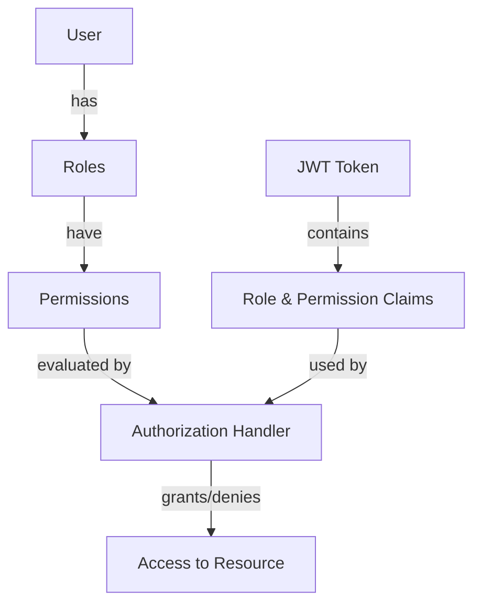

## Overview

SAPFIAI implements a sophisticated authorization system that combines:

- **Role-Based Access Control (RBAC)** - Users assigned to roles
- **Permission-Based Authorization** - Fine-grained permissions assigned to roles
- **Policy-Based Authorization** - ASP.NET Core authorization policies
- **Claim-Based Authorization** - JWT claims for authorization decisions

<Info>
  Authorization determines what authenticated users can do, while authentication verifies who they are.
</Info>

## Authorization Architecture



## Permission-Based Authorization

### Permission Entity

From `src/Domain/Entities/Permission.cs:6`:

```csharp Permission.cs
public class Permission : BaseEntity
{
    /// <summary>
    /// Unique permission name (e.g., "users.create")
    /// </summary>
    public string Name { get; set; } = string.Empty;

    /// <summary>
    /// Description of what this permission allows
    /// </summary>
    public string? Description { get; set; }

    /// <summary>
    /// Module this permission belongs to (e.g., "Users", "Reports")
    /// </summary>
    public string Module { get; set; } = string.Empty;

    /// <summary>
    /// Whether this permission is currently active
    /// </summary>
    public bool IsActive { get; set; } = true;

    /// <summary>
    /// Relationship to roles through RolePermission
    /// </summary>
    public ICollection<RolePermission> RolePermissions { get; set; } = new List<RolePermission>();
}
```

### Permission Naming Convention

Permissions follow a hierarchical naming pattern:

```
{module}.{action}
```

**Examples:**
- `users.create` - Create new users
- `users.read` - View user information
- `users.update` - Modify existing users
- `users.delete` - Delete users
- `reports.view` - View reports
- `settings.manage` - Manage system settings

<Tip>
  Use lowercase with dots to separate module and action for consistency and clarity.
</Tip>

## Authorization Implementation

### Permission Authorization Handler

From `src/Infrastructure/Authorization/PermissionAuthorizationHandler.cs:5`:

```csharp PermissionAuthorizationHandler.cs
public class PermissionAuthorizationHandler : AuthorizationHandler<PermissionRequirement>
{
    protected override Task HandleRequirementAsync(
        AuthorizationHandlerContext context, 
        PermissionRequirement requirement)
    {
        // Check if user has the required permission claim
        var permissionClaim = context.User.FindFirst(c => 
            c.Type == "permission" && 
            c.Value == requirement.Permission);

        if (permissionClaim != null)
        {
            context.Succeed(requirement);
        }

        return Task.CompletedTask;
    }
}
```

### Permission Requirement

```csharp PermissionRequirement.cs
public class PermissionRequirement : IAuthorizationRequirement
{
    public string Permission { get; }

    public PermissionRequirement(string permission)
    {
        Permission = permission;
    }
}
```

## Using Authorization in Endpoints

### Require Authorization

From `src/Web/Endpoints/Authentication.cs:71`:

```csharp
group.MapPost("/logout", Logout)
    .WithName("Logout")
    .WithOpenApi()
    .Produces<Result>(StatusCodes.Status200OK)
    .RequireAuthorization();  // Requires authenticated user
```

### Require Specific Permission

```csharp
group.MapGet("/audit-logs", GetAuditLogs)
    .WithName("GetAuditLogs")
    .Produces<IEnumerable<AuditLogDto>>(StatusCodes.Status200OK)
    .WithOpenApi()
    .RequireAuthorization("CanPurge");  // Requires specific permission
```

### Require Role

```csharp
group.MapPost("/admin/settings", UpdateSettings)
    .RequireAuthorization(policy => policy.RequireRole("Administrator"));
```

## Policy-Based Authorization

### Defining Authorization Policies

From `src/Domain/Constants/Policies.cs`:

```csharp Policies.cs
public static class Policies
{
    public const string CanPurge = nameof(CanPurge);
    public const string CanManageUsers = nameof(CanManageUsers);
    public const string CanViewReports = nameof(CanViewReports);
    public const string CanManageRoles = nameof(CanManageRoles);
}
```

### Registering Policies

In `src/Infrastructure/DependencyInjection.cs`:

```csharp
services.AddAuthorizationBuilder()
    .AddPolicy(Policies.CanPurge, policy =>
        policy.Requirements.Add(new PermissionRequirement("system.purge")))
    .AddPolicy(Policies.CanManageUsers, policy =>
        policy.Requirements.Add(new PermissionRequirement("users.manage")))
    .AddPolicy(Policies.CanViewReports, policy =>
        policy.Requirements.Add(new PermissionRequirement("reports.view")))
    .AddPolicy(Policies.CanManageRoles, policy =>
        policy.Requirements.Add(new PermissionRequirement("roles.manage")));

// Register the permission handler
services.AddScoped<IAuthorizationHandler, PermissionAuthorizationHandler>();
```

## Role-Permission Relationship

### RolePermission Entity

```csharp RolePermission.cs
public class RolePermission
{
    public string RoleId { get; set; } = string.Empty;
    public int PermissionId { get; set; }

    // Navigation properties
    public IdentityRole Role { get; set; } = null!;
    public Permission Permission { get; set; } = null!;
}
```

### Assigning Permissions to Roles

```csharp
// Create command to assign permission to role
var command = new AssignPermissionToRoleCommand
{
    RoleId = "admin-role-id",
    PermissionId = 1
};

await mediator.Send(command);
```

<Accordion title="Complete Assignment Flow">
```csharp AssignPermissionToRoleCommandHandler.cs
public async Task<Result> Handle(
    AssignPermissionToRoleCommand request, 
    CancellationToken cancellationToken)
{
    // Check if role exists
    var role = await _context.Roles
        .FindAsync(new object[] { request.RoleId }, cancellationToken);
    
    if (role == null)
        return Result.Failure(new[] { "Role not found" });

    // Check if permission exists
    var permission = await _context.Permissions
        .FindAsync(new object[] { request.PermissionId }, cancellationToken);
    
    if (permission == null)
        return Result.Failure(new[] { "Permission not found" });

    // Check if already assigned
    var exists = await _context.RolePermissions
        .AnyAsync(rp => 
            rp.RoleId == request.RoleId && 
            rp.PermissionId == request.PermissionId, 
            cancellationToken);

    if (exists)
        return Result.Failure(new[] { "Permission already assigned to role" });

    // Create assignment
    var rolePermission = new RolePermission
    {
        RoleId = request.RoleId,
        PermissionId = request.PermissionId
    };

    _context.RolePermissions.Add(rolePermission);
    await _context.SaveChangesAsync(cancellationToken);

    return Result.Success();
}
```
</Accordion>

## Authorization in Application Layer

### Using IUser Interface

From `src/Application/Common/Interfaces/IUser.cs`:

```csharp
public interface IUser
{
    string? Id { get; }
    string? Email { get; }
    bool IsAuthenticated { get; }
    bool IsInRole(string role);
    bool HasPermission(string permission);
}
```

### Checking Authorization in Handlers

```csharp
public class DeleteUserCommandHandler : IRequestHandler<DeleteUserCommand, Result>
{
    private readonly IUser _currentUser;
    private readonly IApplicationDbContext _context;

    public async Task<Result> Handle(
        DeleteUserCommand request, 
        CancellationToken cancellationToken)
    {
        // Check if user has permission
        if (!_currentUser.HasPermission("users.delete"))
        {
            throw new ForbiddenAccessException();
        }

        // Prevent users from deleting themselves
        if (_currentUser.Id == request.UserId)
        {
            return Result.Failure(new[] { "Cannot delete your own account" });
        }

        // Proceed with deletion
        // ...
    }
}
```

## Common Authorization Patterns

<Tabs>
  <Tab title="Resource Owner">
    Check if user owns the resource they're trying to access:
    
    ```csharp
    var document = await _context.Documents
        .FirstOrDefaultAsync(d => d.Id == request.DocumentId);

    if (document.OwnerId != _currentUser.Id && 
        !_currentUser.IsInRole("Administrator"))
    {
        throw new ForbiddenAccessException();
    }
    ```
  </Tab>

  <Tab title="Hierarchical Permissions">
    Check for module-level or specific permissions:
    
    ```csharp
    // Check if user has module-level permission or specific permission
    var hasAccess = _currentUser.HasPermission("users.*") ||
                    _currentUser.HasPermission("users.update");

    if (!hasAccess)
    {
        throw new ForbiddenAccessException();
    }
    ```
  </Tab>

  <Tab title="Combined Checks">
    Combine role and permission checks:
    
    ```csharp
    // Admins bypass permission checks
    if (!_currentUser.IsInRole("Administrator"))
    {
        // Regular users need specific permission
        if (!_currentUser.HasPermission("reports.sensitive"))
        {
            throw new ForbiddenAccessException();
        }
    }
    ```
  </Tab>

  <Tab title="Time-Based">
    Implement time-based access restrictions:
    
    ```csharp
    // Only allow access during business hours
    var currentHour = DateTime.UtcNow.Hour;
    var isBusinessHours = currentHour >= 8 && currentHour < 18;

    if (!isBusinessHours && !_currentUser.IsInRole("Administrator"))
    {
        throw new ForbiddenAccessException("Access only during business hours");
    }
    ```
  </Tab>
</Tabs>

## Authorization Response Codes

| Status Code | Meaning | When to Use |
|-------------|---------|-------------|
| **401 Unauthorized** | No credentials or invalid credentials | User not authenticated |
| **403 Forbidden** | Valid credentials but insufficient permissions | User authenticated but lacks required permission |
| **404 Not Found** | Resource doesn't exist *or* user can't access it | Hide existence of resources user can't access |

<Warning>
  Always return 404 instead of 403 when hiding resources from unauthorized users to prevent information disclosure.
</Warning>

## Best Practices

<AccordionGroup>
  <Accordion title="Principle of Least Privilege">
    - Grant users only the permissions they absolutely need
    - Start with minimal permissions and add as needed
    - Regularly audit and remove unused permissions
    - Use temporary permission elevation for sensitive operations
  </Accordion>

  <Accordion title="Defense in Depth">
    - Implement authorization at multiple layers (API, Application, Database)
    - Never rely solely on client-side authorization checks
    - Validate authorization even for internal service calls
    - Log all authorization failures for security monitoring
  </Accordion>

  <Accordion title="Permission Granularity">
    - Make permissions specific enough to be useful
    - Avoid overly granular permissions that become unmanageable
    - Group related permissions into modules
    - Use hierarchical naming for easy management
  </Accordion>

  <Accordion title="Testing Authorization">
    - Write tests for both positive and negative authorization cases
    - Test permission boundaries and edge cases
    - Verify that unauthorized access attempts are logged
    - Test role and permission combinations
  </Accordion>
</AccordionGroup>

## Next Steps

<CardGroup cols={2}>
  <Card title="Roles & Permissions" icon="users-gear" href="/concepts/roles-permissions">
    Learn how to create and manage roles and permissions
  </Card>
  <Card title="Authorization API" icon="code" href="/api/roles/overview">
    View the API reference for roles and permissions
  </Card>
  <Card title="Security Features" icon="shield-check" href="/security/audit-logs">
    Explore audit logging for authorization events
  </Card>
  <Card title="Testing" icon="flask-vial" href="/development/testing">
    Learn how to test authorization in your application
  </Card>
</CardGroup>