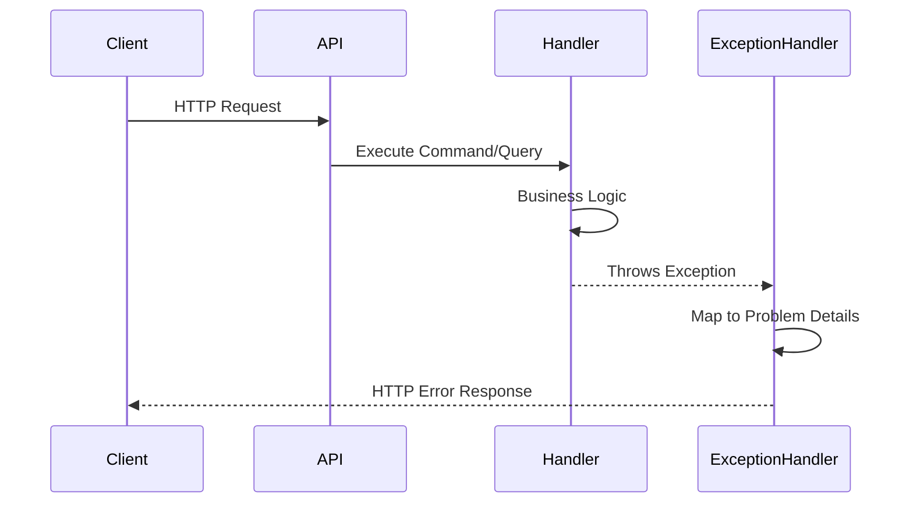

## Overview

SAPFIAI implements a comprehensive error handling strategy using:

- **Global Exception Handler** - Catches all unhandled exceptions
- **RFC 7807 Problem Details** - Standardized error response format
- **Custom Exception Types** - Specific exceptions for different error scenarios
- **Consistent Error Responses** - Predictable error structure across all endpoints

<Info>
  RFC 7807 defines a "problem detail" JSON/XML format for HTTP API error responses.
</Info>

## Exception Handling Architecture



## Custom Exception Handler

From `src/Web/Infrastructure/CustomExceptionHandler.cs:7`:

```csharp CustomExceptionHandler.cs lines
public class CustomExceptionHandler : IExceptionHandler
{
    private readonly Dictionary<Type, Func<HttpContext, Exception, Task>> _exceptionHandlers;

    public CustomExceptionHandler()
    {
        // Register known exception types and handlers
        _exceptionHandlers = new()
        {
            { typeof(ValidationException), HandleValidationException },
            { typeof(NotFoundException), HandleNotFoundException },
            { typeof(UnauthorizedAccessException), HandleUnauthorizedAccessException },
            { typeof(ForbiddenAccessException), HandleForbiddenAccessException },
        };
    }

    public async ValueTask<bool> TryHandleAsync(
        HttpContext httpContext, 
        Exception exception, 
        CancellationToken cancellationToken)
    {
        var exceptionType = exception.GetType();

        if (_exceptionHandlers.ContainsKey(exceptionType))
        {
            await _exceptionHandlers[exceptionType].Invoke(httpContext, exception);
            return true;
        }

        return false; // Let default handler deal with it
    }
}
```

<Note>
  The `TryHandleAsync` method returns `true` if the exception was handled, or `false` to let ASP.NET Core's default exception handler take over.
</Note>

## Exception Types

### ValidationException

**When:** Input validation fails (FluentValidation)

**Status Code:** `400 Bad Request`

**Handler:**
```csharp
private async Task HandleValidationException(HttpContext httpContext, Exception ex)
{
    var exception = (ValidationException)ex;

    httpContext.Response.StatusCode = StatusCodes.Status400BadRequest;

    await httpContext.Response.WriteAsJsonAsync(new ValidationProblemDetails(exception.Errors)
    {
        Status = StatusCodes.Status400BadRequest,
        Type = "https://tools.ietf.org/html/rfc7231#section-6.5.1"
    });
}
```

**Example Response:**
```json
{
  "type": "https://tools.ietf.org/html/rfc7231#section-6.5.1",
  "title": "One or more validation errors occurred.",
  "status": 400,
  "errors": {
    "Email": [
      "Email is required",
      "Invalid email format"
    ],
    "Password": [
      "Password must be at least 8 characters"
    ]
  }
}
```

### NotFoundException

**When:** Requested resource doesn't exist

**Status Code:** `404 Not Found`

**Handler:**
```csharp
private async Task HandleNotFoundException(HttpContext httpContext, Exception ex)
{
    var exception = (NotFoundException)ex;

    httpContext.Response.StatusCode = StatusCodes.Status404NotFound;

    await httpContext.Response.WriteAsJsonAsync(new ProblemDetails()
    {
        Status = StatusCodes.Status404NotFound,
        Type = "https://tools.ietf.org/html/rfc7231#section-6.5.4",
        Title = "The specified resource was not found.",
        Detail = exception.Message
    });
}
```

**Example Response:**
```json
{
  "type": "https://tools.ietf.org/html/rfc7231#section-6.5.4",
  "title": "The specified resource was not found.",
  "status": 404,
  "detail": "User with ID '12345' was not found."
}
```

### UnauthorizedAccessException

**When:** User is not authenticated

**Status Code:** `401 Unauthorized`

**Handler:**
```csharp
private async Task HandleUnauthorizedAccessException(HttpContext httpContext, Exception ex)
{
    httpContext.Response.StatusCode = StatusCodes.Status401Unauthorized;

    await httpContext.Response.WriteAsJsonAsync(new ProblemDetails
    {
        Status = StatusCodes.Status401Unauthorized,
        Title = "Unauthorized",
        Type = "https://tools.ietf.org/html/rfc7235#section-3.1"
    });
}
```

**Example Response:**
```json
{
  "type": "https://tools.ietf.org/html/rfc7235#section-3.1",
  "title": "Unauthorized",
  "status": 401
}
```

### ForbiddenAccessException

**When:** User is authenticated but lacks required permissions

**Status Code:** `403 Forbidden`

**Handler:**
```csharp
private async Task HandleForbiddenAccessException(HttpContext httpContext, Exception ex)
{
    httpContext.Response.StatusCode = StatusCodes.Status403Forbidden;

    await httpContext.Response.WriteAsJsonAsync(new ProblemDetails
    {
        Status = StatusCodes.Status403Forbidden,
        Title = "Forbidden",
        Type = "https://tools.ietf.org/html/rfc7231#section-6.5.3"
    });
}
```

**Example Response:**
```json
{
  "type": "https://tools.ietf.org/html/rfc7231#section-6.5.3",
  "title": "Forbidden",
  "status": 403
}
```

## Using Exceptions in Your Code

### Throwing NotFoundException

```csharp
public class DeletePermissionCommandHandler : IRequestHandler<DeletePermissionCommand, Result>
{
    private readonly IApplicationDbContext _context;

    public async Task<Result> Handle(
        DeletePermissionCommand request, 
        CancellationToken cancellationToken)
    {
        var permission = await _context.Permissions
            .FindAsync(new object[] { request.PermissionId }, cancellationToken);

        if (permission == null)
        {
            throw new NotFoundException(nameof(Permission), request.PermissionId);
        }

        _context.Permissions.Remove(permission);
        await _context.SaveChangesAsync(cancellationToken);

        return Result.Success();
    }
}
```

### Throwing ForbiddenAccessException

```csharp
public class GetSensitiveDataQueryHandler : IRequestHandler<GetSensitiveDataQuery, SensitiveDataDto>
{
    private readonly IUser _currentUser;
    private readonly IApplicationDbContext _context;

    public async Task<SensitiveDataDto> Handle(
        GetSensitiveDataQuery request, 
        CancellationToken cancellationToken)
    {
        // Check if user has required permission
        if (!_currentUser.HasPermission("data.view_sensitive"))
        {
            throw new ForbiddenAccessException();
        }

        // Proceed with query
        // ...
    }
}
```

### Validation Exception (Automatic)

Validation exceptions are thrown automatically by the `ValidationBehaviour` when FluentValidation rules fail:

```csharp
// This validator will cause ValidationException if rules fail
public class CreateUserCommandValidator : AbstractValidator<CreateUserCommand>
{
    public CreateUserCommandValidator()
    {
        RuleFor(x => x.Email)
            .NotEmpty().WithMessage("Email is required")
            .EmailAddress().WithMessage("Invalid email format");
    }
}
```

<Note>
  You don't throw `ValidationException` manually - the MediatR pipeline handles it automatically when validators fail.
</Note>

## RFC 7807 Problem Details

### Standard Fields

<ParamField path="type" type="string" required>
  URI reference identifying the problem type (defaults to about:blank)
</ParamField>

<ParamField path="title" type="string" required>
  Short, human-readable summary of the problem
</ParamField>

<ParamField path="status" type="integer" required>
  HTTP status code generated by the origin server
</ParamField>

<ParamField path="detail" type="string">
  Human-readable explanation specific to this occurrence
</ParamField>

<ParamField path="instance" type="string">
  URI reference identifying the specific occurrence of the problem
</ParamField>

### Extended Fields

For validation errors, additional fields are included:

<ParamField path="errors" type="object">
  Dictionary mapping field names to arrays of error messages
</ParamField>

**Example:**
```json
{
  "errors": {
    "Email": ["Email is required", "Invalid email format"],
    "Password": ["Password must be at least 8 characters"]
  }
}
```

## Configuration

### Register Exception Handler

In `src/Web/Program.cs:47`:

```csharp Program.cs
// Add global exception handling (RFC 7807)
builder.Services.AddProblemDetails();

// ... build app ...

app.UseExceptionHandler(); // Must be called after building app
```

### Development vs Production

<Tabs>
  <Tab title="Development">
    In development, use `UseDeveloperExceptionPage()` for detailed error information:
    
    ```csharp
    if (app.Environment.IsDevelopment())
    {
        app.UseDeveloperExceptionPage();
    }
    else
    {
        app.UseExceptionHandler();
    }
    ```
    
    This shows:
    - Full exception stack trace
    - Source code snippets
    - Request/response details
  </Tab>

  <Tab title="Production">
    In production, use the global exception handler:
    
    ```csharp
    app.UseExceptionHandler();
    app.UseHsts();
    ```
    
    This provides:
    - Consistent error responses
    - No sensitive information leakage
    - RFC 7807 compliant responses
  </Tab>
</Tabs>

## Error Response Examples

### Successful Request

```bash
POST /api/Permissions
Content-Type: application/json

{
  "name": "users.create",
  "module": "Users",
  "description": "Create new users"
}
```

**Response: 200 OK**
```json
{
  "success": true,
  "permissionId": 5,
  "message": "Permission created successfully"
}
```

### Validation Error

```bash
POST /api/Permissions
Content-Type: application/json

{
  "name": "",
  "module": ""
}
```

**Response: 400 Bad Request**
```json
{
  "type": "https://tools.ietf.org/html/rfc7231#section-6.5.1",
  "title": "One or more validation errors occurred.",
  "status": 400,
  "errors": {
    "Name": ["El nombre del permiso es requerido"],
    "Module": ["El módulo es requerido"]
  }
}
```

### Not Found Error

```bash
GET /api/Permissions/999
Authorization: Bearer {token}
```

**Response: 404 Not Found**
```json
{
  "type": "https://tools.ietf.org/html/rfc7231#section-6.5.4",
  "title": "The specified resource was not found.",
  "status": 404,
  "detail": "Permission with ID '999' was not found."
}
```

### Unauthorized Error

```bash
GET /api/Permissions
# No Authorization header
```

**Response: 401 Unauthorized**
```json
{
  "type": "https://tools.ietf.org/html/rfc7235#section-3.1",
  "title": "Unauthorized",
  "status": 401
}
```

### Forbidden Error

```bash
DELETE /api/Permissions/5
Authorization: Bearer {user-token-without-delete-permission}
```

**Response: 403 Forbidden**
```json
{
  "type": "https://tools.ietf.org/html/rfc7231#section-6.5.3",
  "title": "Forbidden",
  "status": 403
}
```

## Best Practices

<AccordionGroup>
  <Accordion title="Use Appropriate Exception Types">
    - Use `NotFoundException` when a resource doesn't exist
    - Use `ForbiddenAccessException` for authorization failures
    - Use `UnauthorizedAccessException` for authentication failures
    - Let `ValidationException` be thrown automatically by validators
    - Create custom exceptions for domain-specific errors
  </Accordion>

  <Accordion title="Provide Clear Error Messages">
    - Include what went wrong and why
    - Avoid exposing sensitive information
    - Use consistent language across all errors
    - Provide actionable guidance when possible
    - Consider internationalization for multi-language support
  </Accordion>

  <Accordion title="Log Exceptions Appropriately">
    - Log all exceptions for monitoring and debugging
    - Include correlation IDs to trace requests
    - Log stack traces in development, summaries in production
    - Monitor error rates and patterns
    - Alert on critical errors
  </Accordion>

  <Accordion title="Hide Implementation Details">
    - Never expose internal paths or file names
    - Don't leak database schema information
    - Avoid stack traces in production responses
    - Use generic messages for unexpected errors
    - Return 404 instead of 403 to hide resource existence
  </Accordion>
</AccordionGroup>

## Creating Custom Exceptions

### Domain-Specific Exception

```csharp
public class DuplicatePermissionException : Exception
{
    public DuplicatePermissionException(string permissionName)
        : base($"Permission '{permissionName}' already exists.")
    {
    }
}
```

### Register Custom Handler

```csharp
public CustomExceptionHandler()
{
    _exceptionHandlers = new()
    {
        { typeof(ValidationException), HandleValidationException },
        { typeof(NotFoundException), HandleNotFoundException },
        { typeof(UnauthorizedAccessException), HandleUnauthorizedAccessException },
        { typeof(ForbiddenAccessException), HandleForbiddenAccessException },
        { typeof(DuplicatePermissionException), HandleDuplicatePermissionException }, // New
    };
}

private async Task HandleDuplicatePermissionException(HttpContext httpContext, Exception ex)
{
    httpContext.Response.StatusCode = StatusCodes.Status409Conflict;

    await httpContext.Response.WriteAsJsonAsync(new ProblemDetails
    {
        Status = StatusCodes.Status409Conflict,
        Title = "Duplicate Resource",
        Detail = ex.Message,
        Type = "https://tools.ietf.org/html/rfc7231#section-6.5.8"
    });
}
```

## Client Error Handling

### JavaScript/TypeScript

```typescript
try {
  const response = await fetch('/api/Permissions', {
    method: 'POST',
    headers: {
      'Content-Type': 'application/json',
      'Authorization': `Bearer ${token}`
    },
    body: JSON.stringify({
      name: 'users.create',
      module: 'Users'
    })
  });

  if (!response.ok) {
    const problem = await response.json();
    
    // Handle different error types
    switch (problem.status) {
      case 400:
        // Validation errors
        console.error('Validation errors:', problem.errors);
        break;
      case 401:
        // Redirect to login
        window.location.href = '/login';
        break;
      case 403:
        // Show permission denied message
        alert('You do not have permission to perform this action');
        break;
      case 404:
        // Resource not found
        console.error('Resource not found:', problem.detail);
        break;
      default:
        // Generic error
        console.error('An error occurred:', problem.title);
    }
  }
} catch (error) {
  console.error('Network error:', error);
}
```

### C# Client

```csharp
try
{
    var response = await httpClient.PostAsJsonAsync("/api/Permissions", request);
    
    if (!response.IsSuccessStatusCode)
    {
        var problem = await response.Content.ReadFromJsonAsync<ProblemDetails>();
        
        switch (response.StatusCode)
        {
            case HttpStatusCode.BadRequest:
                // Handle validation errors
                var validationProblem = await response.Content
                    .ReadFromJsonAsync<ValidationProblemDetails>();
                foreach (var error in validationProblem.Errors)
                {
                    Console.WriteLine($"{error.Key}: {string.Join(", ", error.Value)}");
                }
                break;
                
            case HttpStatusCode.NotFound:
                Console.WriteLine($"Not found: {problem.Detail}");
                break;
                
            case HttpStatusCode.Forbidden:
                Console.WriteLine("Access denied");
                break;
        }
    }
}
catch (HttpRequestException ex)
{
    Console.WriteLine($"Network error: {ex.Message}");
}
```

## Next Steps

<CardGroup cols={2}>
  <Card title="Validation" icon="check-double" href="/concepts/validation">
    Learn about input validation with FluentValidation
  </Card>
  <Card title="Testing" icon="flask-vial" href="/development/testing">
    Test error handling scenarios
  </Card>
  <Card title="Audit Logs" icon="clipboard-list" href="/security/audit-logs">
    Monitor errors and exceptions with audit logs
  </Card>
  <Card title="Configuration" icon="gear" href="/development/configuration">
    Configure error handling behavior
  </Card>
</CardGroup>