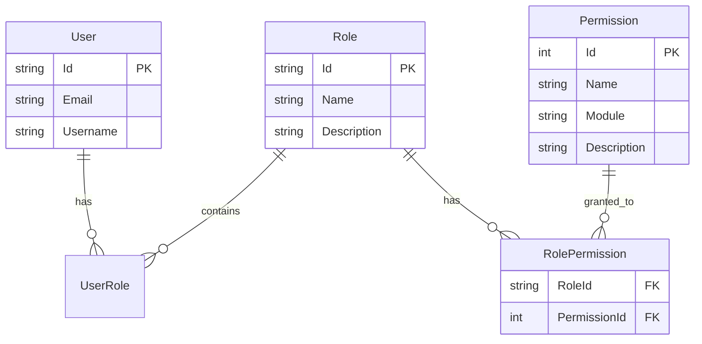

## Overview

SAPFIAI implements a flexible Role-Based Access Control (RBAC) system where:

- **Roles** group users with similar responsibilities
- **Permissions** define specific actions users can perform
- **RolePermissions** link permissions to roles (many-to-many relationship)
- **Users** are assigned to one or more roles



## Roles

### Predefined Roles

SAPFIAI comes with three predefined roles:

<CardGroup cols={3}>
  <Card title="Administrator" icon="crown">
    Full system access with all permissions
  </Card>
  <Card title="User" icon="user">
    Basic user with limited permissions
  </Card>
  <Card title="Manager" icon="user-tie">
    Intermediate role with management capabilities
  </Card>
</CardGroup>

### Role Entity

Roles are managed using ASP.NET Core Identity's `IdentityRole`:

```csharp
public class IdentityRole
{
    public string Id { get; set; }           // Unique role ID
    public string Name { get; set; }         // Role name (e.g., "Administrator")
    public string NormalizedName { get; set; } // Uppercase for case-insensitive comparison
    public string? ConcurrencyStamp { get; set; } // For optimistic concurrency
}
```

### Creating Roles

Use the `CreateRoleCommand` to create new roles:

```csharp
var command = new CreateRoleCommand
{
    Name = "ContentEditor",
    Description = "Can create and edit content but not publish"
};

var result = await mediator.Send(command);

if (result.Succeeded)
{
    Console.WriteLine($"Role created with ID: {result.Value}");
}
```

<Accordion title="API Request Example">
```bash cURL
curl -X POST https://api.example.com/api/Roles \
  -H "Authorization: Bearer {token}" \
  -H "Content-Type: application/json" \
  -d '{
    "name": "ContentEditor",
    "description": "Can create and edit content but not publish"
  }'
```

**Response:**
```json
{
  "success": true,
  "roleId": "role-id-123",
  "message": "Role created successfully"
}
```
</Accordion>

## Permissions

### Permission Entity

From `src/Domain/Entities/Permission.cs:6`:

```csharp Permission.cs
public class Permission : BaseEntity
{
    public string Name { get; set; } = string.Empty;        // e.g., "users.create"
    public string? Description { get; set; }                 // Human-readable description
    public string Module { get; set; } = string.Empty;       // e.g., "Users", "Reports"
    public bool IsActive { get; set; } = true;              // Can be disabled without deleting
    public DateTime CreatedAt { get; set; } = DateTime.UtcNow;
    
    // Navigation property
    public ICollection<RolePermission> RolePermissions { get; set; } = new List<RolePermission>();
}
```

### Permission Naming Convention

Follow the pattern: `{module}.{action}`

| Module | Permission | Description |
|--------|-----------|-------------|
| Users | `users.create` | Create new users |
| Users | `users.read` | View user information |
| Users | `users.update` | Modify existing users |
| Users | `users.delete` | Delete users |
| Reports | `reports.view` | View reports |
| Reports | `reports.export` | Export report data |
| Settings | `settings.view` | View system settings |
| Settings | `settings.manage` | Modify system settings |
| Audit | `audit.view` | View audit logs |
| Audit | `audit.purge` | Delete audit logs |

<Tip>
  Use module-level wildcards for comprehensive access: `users.*` grants all user permissions
</Tip>

### Creating Permissions

From `src/Application/Permissions/Commands/CreatePermission/CreatePermissionCommand.cs`:

```csharp
var command = new CreatePermissionCommand
{
    Name = "reports.export",
    Description = "Export report data to CSV/Excel",
    Module = "Reports"
};

var result = await mediator.Send(command);
```

### Permission Validation

From `src/Application/Permissions/Commands/CreatePermission/CreatePermissionCommandValidator.cs:5`:

```csharp CreatePermissionCommandValidator.cs
public class CreatePermissionCommandValidator : AbstractValidator<CreatePermissionCommand>
{
    public CreatePermissionCommandValidator()
    {
        RuleFor(x => x.Name)
            .NotEmpty().WithMessage("El nombre del permiso es requerido")
            .MaximumLength(100).WithMessage("El nombre no puede exceder 100 caracteres")
            .Matches("^[a-z0-9._-]+$").WithMessage("Use formato: modulo.accion (ej: users.create)");

        RuleFor(x => x.Module)
            .NotEmpty().WithMessage("El módulo es requerido")
            .MaximumLength(50).WithMessage("El módulo no puede exceder 50 caracteres");

        RuleFor(x => x.Description)
            .MaximumLength(500).WithMessage("La descripción no puede exceder 500 caracteres")
            .When(x => !string.IsNullOrEmpty(x.Description));
    }
}
```

<Note>
  Permission names must be lowercase alphanumeric with dots, underscores, or hyphens only.
</Note>

## Role-Permission Assignment

### Assigning Permissions to Roles

<Steps>
  <Step title="Verify role and permission exist">
    ```csharp
    var role = await roleManager.FindByIdAsync(roleId);
    var permission = await context.Permissions.FindAsync(permissionId);
    
    if (role == null || permission == null)
        throw new NotFoundException();
    ```
  </Step>

  <Step title="Check for existing assignment">
    ```csharp
    var exists = await context.RolePermissions
        .AnyAsync(rp => 
            rp.RoleId == roleId && 
            rp.PermissionId == permissionId);
    
    if (exists)
        return Result.Failure(new[] { "Permission already assigned" });
    ```
  </Step>

  <Step title="Create assignment">
    ```csharp
    var rolePermission = new RolePermission
    {
        RoleId = roleId,
        PermissionId = permissionId
    };
    
    context.RolePermissions.Add(rolePermission);
    await context.SaveChangesAsync();
    ```
  </Step>

  <Step title="Regenerate user tokens">
    <Info>
      Users need to refresh their tokens to receive updated permissions in claims
    </Info>
  </Step>
</Steps>

### API Example

```bash
POST /api/Permissions/assign
Content-Type: application/json
Authorization: Bearer {admin-token}

{
  "roleId": "admin-role-id",
  "permissionId": 5
}
```

### Removing Permissions from Roles

```csharp
var command = new RemovePermissionFromRoleCommand
{
    RoleId = "editor-role-id",
    PermissionId = 3
};

var result = await mediator.Send(command);
```

## User Role Assignment

### Assigning Roles to Users

```csharp
var command = new AssignRoleToUserCommand
{
    UserId = "user-123",
    RoleId = "manager-role-id"
};

var result = await mediator.Send(command);
```

<Accordion title="Complete Handler Implementation">
```csharp AssignRoleToUserCommandHandler.cs
public class AssignRoleToUserCommandHandler 
    : IRequestHandler<AssignRoleToUserCommand, Result>
{
    private readonly UserManager<ApplicationUser> _userManager;
    private readonly RoleManager<IdentityRole> _roleManager;

    public async Task<Result> Handle(
        AssignRoleToUserCommand request, 
        CancellationToken cancellationToken)
    {
        // Find user
        var user = await _userManager.FindByIdAsync(request.UserId);
        if (user == null)
            return Result.Failure(new[] { "User not found" });

        // Find role
        var role = await _roleManager.FindByIdAsync(request.RoleId);
        if (role == null)
            return Result.Failure(new[] { "Role not found" });

        // Check if already assigned
        var isInRole = await _userManager.IsInRoleAsync(user, role.Name!);
        if (isInRole)
            return Result.Failure(new[] { "User already has this role" });

        // Assign role
        var result = await _userManager.AddToRoleAsync(user, role.Name!);
        
        if (!result.Succeeded)
        {
            return Result.Failure(
                result.Errors.Select(e => e.Description).ToArray());
        }

        return Result.Success();
    }
}
```
</Accordion>

### Removing Roles from Users

```bash
POST /api/Roles/remove
Content-Type: application/json
Authorization: Bearer {admin-token}

{
  "userId": "user-123",
  "roleId": "role-to-remove"
}
```

## Querying Roles and Permissions

### Get User Roles

```csharp
var query = new GetUserRolesQuery { UserId = "user-123" };
var roles = await mediator.Send(query);

foreach (var role in roles)
{
    Console.WriteLine($"{role.Name}: {role.Description}");
}
```

### Get Role Permissions

```csharp
var query = new GetRolePermissionsQuery { RoleId = "admin-role-id" };
var permissions = await mediator.Send(query);

foreach (var permission in permissions)
{
    Console.WriteLine($"{permission.Module}.{permission.Name}");
}
```

### Get All Permissions by Module

```bash
GET /api/Permissions?module=Users&activeOnly=true
Authorization: Bearer {token}
```

**Response:**
```json
[
  {
    "id": 1,
    "name": "users.create",
    "description": "Create new users",
    "module": "Users",
    "isActive": true,
    "createdAt": "2024-01-15T10:30:00Z"
  },
  {
    "id": 2,
    "name": "users.update",
    "description": "Modify existing users",
    "module": "Users",
    "isActive": true,
    "createdAt": "2024-01-15T10:30:00Z"
  }
]
```

## Common Patterns

### Setting Up a New Role

<Steps>
  <Step title="Create the role">
    ```csharp
    var createRole = new CreateRoleCommand
    {
        Name = "ContentModerator",
        Description = "Reviews and approves user-generated content"
    };
    var roleResult = await mediator.Send(createRole);
    var roleId = roleResult.Value;
    ```
  </Step>

  <Step title="Create permissions">
    ```csharp
    var permissions = new[]
    {
        new CreatePermissionCommand { Name = "content.view", Module = "Content" },
        new CreatePermissionCommand { Name = "content.approve", Module = "Content" },
        new CreatePermissionCommand { Name = "content.reject", Module = "Content" }
    };

    var permissionIds = new List<int>();
    foreach (var perm in permissions)
    {
        var result = await mediator.Send(perm);
        permissionIds.Add(result.Value);
    }
    ```
  </Step>

  <Step title="Assign permissions to role">
    ```csharp
    foreach (var permissionId in permissionIds)
    {
        await mediator.Send(new AssignPermissionToRoleCommand
        {
            RoleId = roleId,
            PermissionId = permissionId
        });
    }
    ```
  </Step>

  <Step title="Assign users to role">
    ```csharp
    await mediator.Send(new AssignRoleToUserCommand
    {
        UserId = "moderator-user-id",
        RoleId = roleId
    });
    ```
  </Step>
</Steps>

## Permission Inheritance

<Info>
  While SAPFIAI doesn't implement automatic permission inheritance, you can achieve similar results with proper role design.
</Info>

### Hierarchical Roles Strategy

```
Administrator (all permissions)
  └─ Manager (subset of admin permissions)
      └─ User (basic permissions)
```

**Implementation:**

1. Create base roles with incremental permissions
2. Assign users to the most restrictive role that meets their needs
3. For special cases, create custom roles or assign additional permissions

## Best Practices

<AccordionGroup>
  <Accordion title="Role Design">
    - Create roles based on job functions, not individuals
    - Keep the number of roles manageable (5-15 is typical)
    - Name roles clearly ("ContentEditor" not "Role3")
    - Document what each role can do
    - Review role assignments quarterly
  </Accordion>

  <Accordion title="Permission Management">
    - Group permissions by module for easier management
    - Use consistent naming conventions
    - Mark unused permissions as inactive rather than deleting
    - Document the purpose of each permission
    - Audit permission usage regularly
  </Accordion>

  <Accordion title="Security">
    - Implement the principle of least privilege
    - Require re-authentication for sensitive permission changes
    - Log all role and permission modifications
    - Review and revoke unused roles periodically
    - Separate administrative roles from regular user roles
  </Accordion>

  <Accordion title="Testing">
    - Test each role's access boundaries
    - Verify permission combinations work correctly
    - Test role assignment and removal
    - Ensure UI reflects user permissions correctly
    - Test edge cases (user with no roles, inactive permissions)
  </Accordion>
</AccordionGroup>

## Troubleshooting

<AccordionGroup>
  <Accordion title="User has role but no permissions">
    **Cause:** Permissions not assigned to the role
    
    **Solution:**
    ```csharp
    // Check role permissions
    var query = new GetRolePermissionsQuery { RoleId = roleId };
    var permissions = await mediator.Send(query);
    
    if (!permissions.Any())
    {
        // Assign missing permissions
    }
    ```
  </Accordion>

  <Accordion title="Permission changes not taking effect">
    **Cause:** JWT tokens cache permissions; changes require new tokens
    
    **Solution:**
    - Ask user to log out and log back in
    - Implement token refresh endpoint
    - Set shorter token expiration times
    - Invalidate existing tokens on permission change
  </Accordion>

  <Accordion title="Cannot delete role">
    **Cause:** Role is assigned to users or has dependencies
    
    **Solution:**
    ```csharp
    // Check for users with this role
    var usersInRole = await _userManager.GetUsersInRoleAsync(roleName);
    
    if (usersInRole.Any())
    {
        // Reassign users or remove role assignment
        foreach (var user in usersInRole)
        {
            await _userManager.RemoveFromRoleAsync(user, roleName);
        }
    }
    
    // Now delete the role
    await _roleManager.DeleteAsync(role);
    ```
  </Accordion>
</AccordionGroup>

## Next Steps

<CardGroup cols={2}>
  <Card title="Authorization" icon="lock" href="/concepts/authorization">
    Learn how permissions are enforced in the application
  </Card>
  <Card title="Roles API" icon="code" href="/api/roles/overview">
    View the complete API reference for roles
  </Card>
  <Card title="Permissions API" icon="code" href="/api/permissions/overview">
    View the complete API reference for permissions
  </Card>
  <Card title="Security" icon="shield-check" href="/security/audit-logs">
    Monitor role and permission changes with audit logs
  </Card>
</CardGroup>