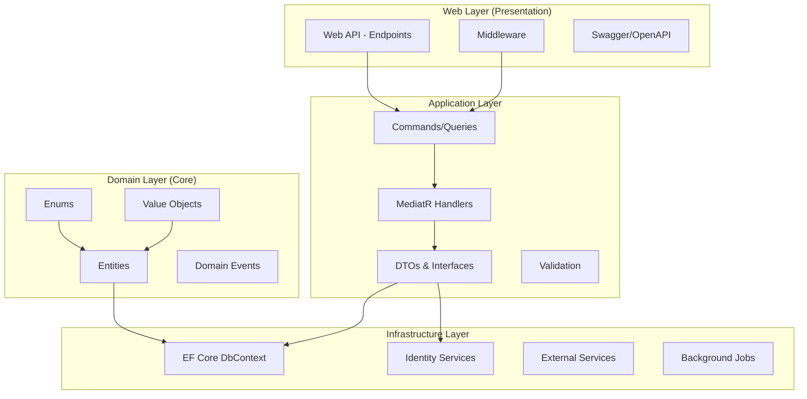

## What is SAPFIAI?

SAPFIAI is a production-ready API template built with **Clean Architecture** principles and **ASP.NET Core 8.0**. It provides a solid foundation for building scalable, maintainable, and testable enterprise applications with built-in security, authentication, and authorization features.

The template follows industry best practices and implements **CQRS** (Command Query Responsibility Segregation) pattern using **MediatR**, making it easy to separate read and write operations while keeping your codebase organized and maintainable.

<Info>
  SAPFIAI stands for a technical template designed to accelerate enterprise API development while maintaining high code quality and architectural standards.
</Info>

## Key Features

<CardGroup cols={2}>
  <Card title="Clean Architecture" icon="layer-group">
    Separation of concerns with four distinct layers: Domain, Application, Infrastructure, and Web (Presentation)
  </Card>
  
  <Card title="CQRS with MediatR" icon="code-branch">
    Command and Query separation for better scalability and maintainability
  </Card>
  
  <Card title="Advanced Security" icon="shield-halved">
    JWT authentication, refresh tokens, 2FA, rate limiting, IP blacklisting, and account lockout protection
  </Card>
  
  <Card title="Entity Framework Core 8" icon="database">
    Code-first database approach with migrations support for SQL Server and SQLite
  </Card>
  
  <Card title="FluentValidation" icon="circle-check">
    Centralized validation logic with expressive, easy-to-test validation rules
  </Card>
  
  <Card title="AutoMapper" icon="arrows-rotate">
    Automatic object-to-object mapping between DTOs and domain entities
  </Card>
  
  <Card title="Comprehensive Testing" icon="flask">
    Unit, functional, and integration tests using NUnit, FluentAssertions, Moq, and Respawn
  </Card>
  
  <Card title="CI/CD Ready" icon="rocket">
    Pre-configured pipelines for GitHub Actions and Azure DevOps
  </Card>
</CardGroup>

## Architecture Overview

SAPFIAI follows **Clean Architecture** principles, organizing code into four distinct layers:



### Layer Responsibilities

<Accordion title="Domain Layer (Core Business Logic)">
  - **Entities**: Core business objects (e.g., `ApplicationUser`, `Permission`, `AuditLog`)
  - **Value Objects**: Immutable objects representing domain concepts
  - **Enums**: Domain-specific enumerations (e.g., `LoginFailureReason`, `BlackListReason`)
  - **Exceptions**: Custom domain exceptions
  - **No dependencies** on other layers

  Located in: `src/Domain/`
</Accordion>

<Accordion title="Application Layer (Use Cases)">
  - **Commands & Queries**: CQRS implementation using MediatR
  - **Handlers**: Business logic execution
  - **DTOs**: Data transfer objects for API communication
  - **Validators**: FluentValidation rules
  - **Interfaces**: Contracts for infrastructure services
  - **Depends only** on Domain layer

  Located in: `src/Application/`
</Accordion>

<Accordion title="Infrastructure Layer (External Concerns)">
  - **DbContext**: Entity Framework Core configuration
  - **Services**: Concrete implementations (email, authentication, security)
  - **Identity**: ASP.NET Core Identity configuration
  - **Background Jobs**: Scheduled cleanup tasks
  - **Migrations**: Database schema versioning
  - **Depends on** Application and Domain layers

  Located in: `src/Infrastructure/`
</Accordion>

<Accordion title="Web Layer (Presentation)">
  - **Endpoints**: Minimal API endpoints
  - **Middleware**: IP blocking, exception handling
  - **Configuration**: Dependency injection setup
  - **Swagger**: API documentation
  - **Depends on** all other layers

  Located in: `src/Web/`
</Accordion>

## Technology Stack

| Technology | Version | Purpose |
|------------|---------|----------|
| **ASP.NET Core** | 8.0 | Web framework and API foundation |
| **Entity Framework Core** | 8.0 | ORM and database migrations |
| **MediatR** | 12.x | CQRS mediator pattern |
| **AutoMapper** | 12.x | Object-to-object mapping |
| **FluentValidation** | 11.x | Input validation |
| **ASP.NET Core Identity** | 8.0 | User authentication and management |
| **NUnit** | 3.x | Unit testing framework |
| **FluentAssertions** | 6.x | Readable test assertions |
| **Moq** | 4.x | Mocking framework for tests |
| **Respawn** | 6.x | Database cleanup for tests |

## Security Features

SAPFIAI includes enterprise-grade security features out of the box:

<CardGroup cols={2}>
  <Card title="JWT Authentication" icon="key">
    Secure token-based authentication with configurable expiration
  </Card>
  
  <Card title="Refresh Tokens" icon="arrows-rotate">
    Long-lived tokens with automatic rotation for enhanced security
  </Card>
  
  <Card title="Two-Factor Authentication" icon="mobile">
    Optional 2FA via email for additional account protection
  </Card>
  
  <Card title="Rate Limiting" icon="gauge-high">
    IP-based rate limiting to prevent brute force attacks (5 attempts per 15 minutes)
  </Card>
  
  <Card title="IP Blacklisting" icon="ban">
    Automatic and manual IP blocking with configurable expiration
  </Card>
  
  <Card title="Account Lockout" icon="lock">
    Temporary account lockout after failed login attempts (5 attempts = 15 min lockout)
  </Card>
  
  <Card title="Audit Logging" icon="file-lines">
    Complete audit trail of all authentication and security events
  </Card>
  
  <Card title="Background Cleanup" icon="broom">
    Automated cleanup of expired tokens, IP blocks, and old audit logs
  </Card>
</CardGroup>

## CQRS Pattern

SAPFIAI implements the CQRS pattern to separate read and write operations:

```csharp
// Command Example - Write Operation
public record RegisterCommand : IRequest<RegisterResponse>
{
    public required string Email { get; init; }
    public required string Password { get; init; }
    public required string ConfirmPassword { get; init; }
}

// Query Example - Read Operation
public record GetPermissionsQuery : IRequest<List<PermissionDto>>
{
    public int? ModuleId { get; init; }
}
```

<Tip>
  Use commands for operations that modify state (Create, Update, Delete) and queries for operations that only read data. This separation makes your code more maintainable and easier to test.
</Tip>

## Use Cases

SAPFIAI is ideal for:

- **Enterprise APIs**: Build robust, scalable APIs for enterprise applications
- **Microservices**: Use as a template for individual microservices
- **Authentication Services**: Leverage built-in security features for auth services
- **Learning**: Understand Clean Architecture and CQRS patterns in practice
- **Rapid Prototyping**: Start new projects with a solid foundation

## What's Next?

<CardGroup cols={2}>
  <Card title="Quickstart" icon="bolt" href="/quickstart">
    Get your API running in under 5 minutes
  </Card>
  
  <Card title="Installation" icon="download" href="/installation">
    Detailed installation and configuration guide
  </Card>
  
  <Card title="Authentication" icon="shield" href="/api/authentication/login">
    Learn about authentication endpoints
  </Card>
  
  <Card title="Architecture" icon="sitemap" href="/architecture/overview">
    Deep dive into the architecture
  </Card>
</CardGroup>

## System Requirements

<Note>
  Before getting started, ensure you have:
  - **.NET 8.0 SDK** or higher
  - **SQL Server** (LocalDB, Express, or full) or **SQLite**
  - **Visual Studio 2022+** or **VS Code** with C# extension
  - **Git** for version control
</Note>

## Community and Support

SAPFIAI is based on Clean Architecture principles popularized by Robert C. Martin (Uncle Bob) and Jason Taylor's Clean Architecture template.

<CardGroup cols={2}>
  <Card title="Clean Architecture" icon="book" href="https://blog.cleancoder.com/uncle-bob/2012/08/13/the-clean-architecture.html">
    Original Clean Architecture article by Uncle Bob
  </Card>
  
  <Card title=".NET 8 Documentation" icon="file-code" href="https://learn.microsoft.com/en-us/dotnet/core/whats-new/dotnet-8">
    Official .NET 8 documentation
  </Card>
</CardGroup>